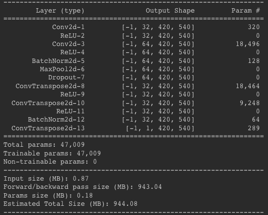
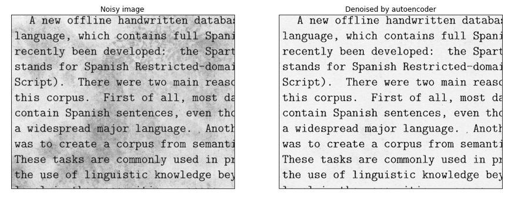
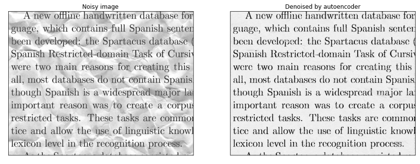

# Denoising with Autoencoder

### info:
- Pytorch.
- [Dataset](https://www.kaggle.com/c/denoising-dirty-documents).
- Training: 100 epochs 

### Architecture:
- Input shape (1, 540 , 420).

### Results

